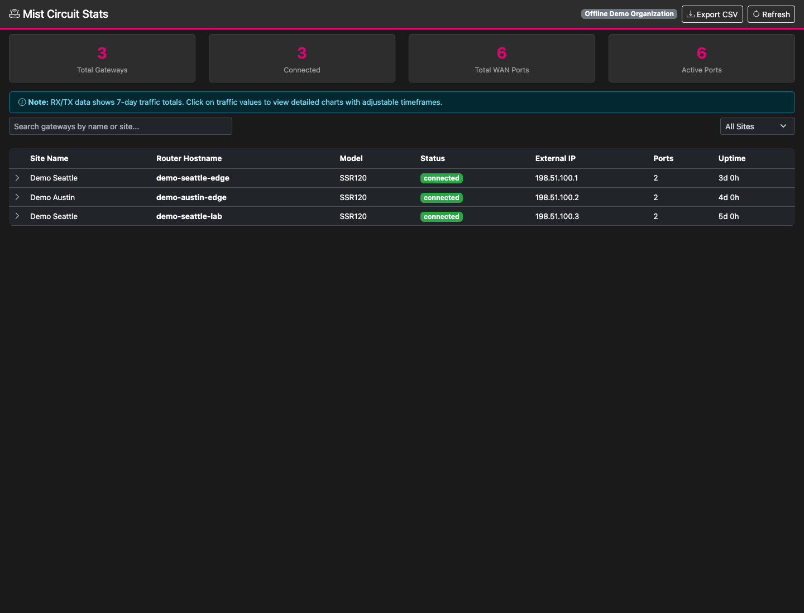
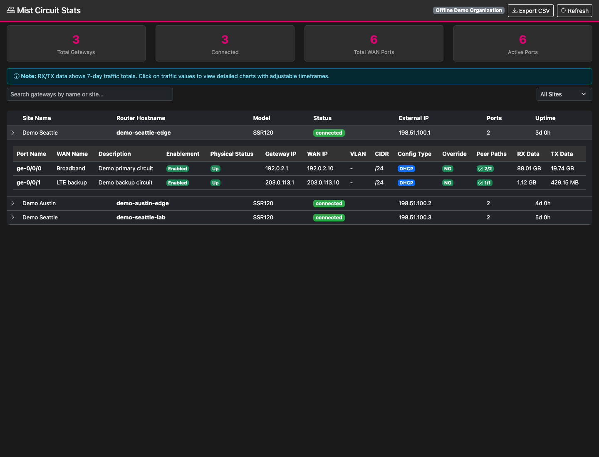
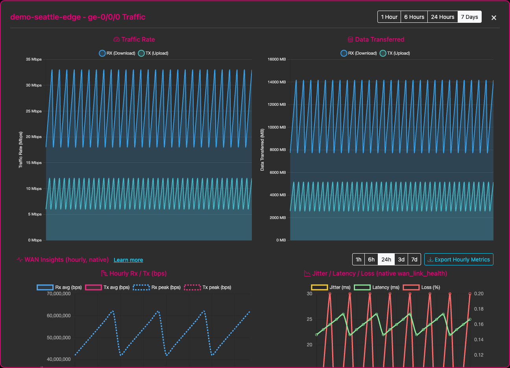
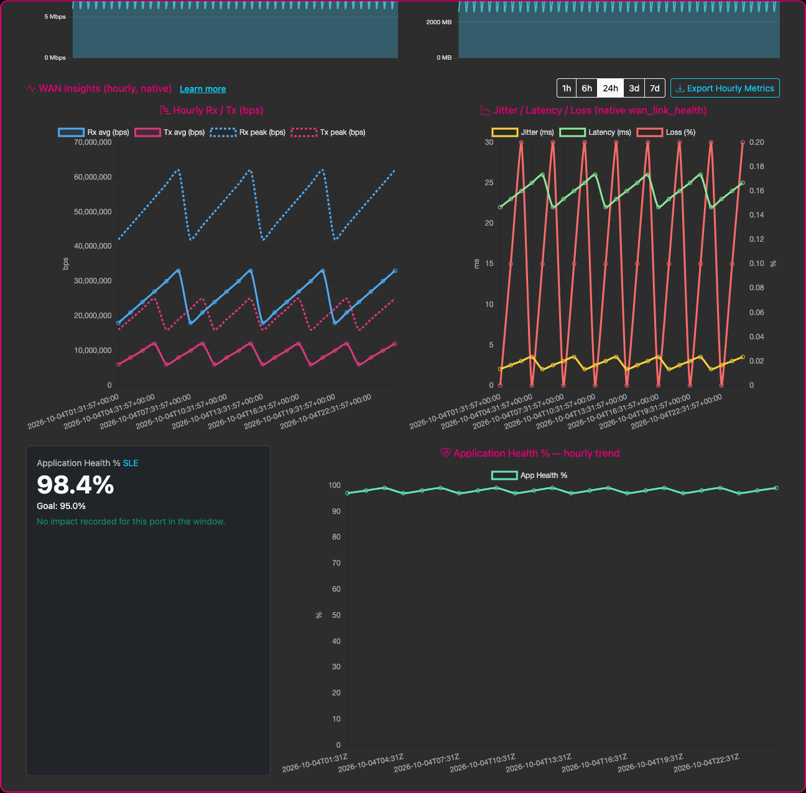
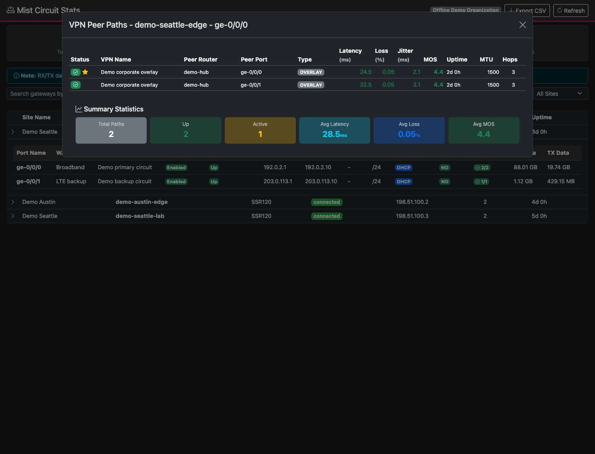

# MistCircuitStats

## What

A Flask dashboard for Juniper Mist Gateway WAN port statistics across an
organization: gateway and site filtering, expandable port details, traffic
charts, WAN Insights, VPN peer paths and CSV exports.

These are genuine captures of the application UI with **synthetic offline demo
data**, not a live customer organization. [Screenshot provenance and reproduction](docs/screenshots.md).

**Organization dashboard**

**Gateway WAN port details**

**Port traffic charts**

**WAN Insights**

**VPN peer paths**

## How

Use Python 3.13+ with a read-only Mist API token, or run the published container
with Docker / Podman. Follow the [setup guide](docs/guide.md#quick-start) and
[configuration reference](docs/guide.md#configuration). Do not commit credentials.

For operation and development, see the [API reference](docs/guide.md#mist-api-endpoints),
[HTTP routes and limitations](docs/guide.md#http-routes),
[quality gates](docs/guide.md#quality-gates) and
[troubleshooting](docs/guide.md#troubleshooting).

## Where

Open the dashboard at <http://localhost:5000> after starting it.
Source and issue tracking: [jmorrison-juniper/MistCircuitStats](https://github.com/jmorrison-juniper/MistCircuitStats).
Published image: `ghcr.io/jmorrison-juniper/mistcircuitstats:latest` (amd64 / arm64).

Detailed documentation is in [docs/](docs/guide.md), including the
[architecture](docs/guide.md#architecture),
[WAN Insights customer response](docs/customer_response_wan_insights.md) and
[screenshot capture guide](docs/screenshots.md).

## When

Use it when reviewing gateway status, troubleshooting WAN circuits or exporting
port metrics. The main table loads seven days of data; charts and WAN Insights
offer shorter windows. See [timeframes and retention limits](docs/guide.md#http-routes).
Release history is preserved in the [changelog](docs/CHANGELOG.md).

## Why

Bring organization-wide WAN configuration, traffic and native Mist health metrics
into one searchable view, reducing per-gateway navigation and making circuit
comparisons and exports easier.

## Who

For network operators and engineers managing Juniper Mist gateways.
Maintained by Joseph Morrison &lt;jmorrison@juniper.net&gt;.
[Contributions](docs/guide.md#contributing) are welcome.
Licensed under [CC BY-NC-SA 4.0](LICENSE);
see [license details](docs/guide.md#license) and [related projects](docs/guide.md#related-projects).
